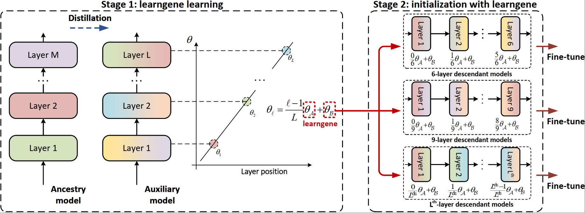

# Transformer as Linear Expansion of Learngene (AAAI 2024)

[](https://opensource.org/licenses/Apache-2.0) 
<a href="https://pytorch.org/get-started/locally/"></a>

This is the official PyTorch implementation of **AAAI 2024** paper [Transformer as Linear Expansion of Learngene].

**Title:** Transformer as Linear Expansion of Learngene

**Authors:** Shiyu Xia, Miaosen Zhang, Xu Yang, Ruiming Chen, Haokun Chen, Xin Geng

**Affliations:** Southeast University


## A Gentle Introduction



In the first stage, we construct an auxiliary model wherein each layer is linearly expanded from learngene. Subsequently, we train it through distillation. After obtaining learngene with well-trained $\theta_{\mathcal{A}}$ and $\theta_{\mathcal{B}}$, in the second stage, we initialize descendant models of varying depths via adopting linear expansion on $\theta_{\mathcal{A}}$ and $\theta_{\mathcal{B}}$, enabling adaptation to diverse resource constraints. Lastly, the descendant models are fine-tuned normally without the restriction of linear expansion.


## Running TLEG

We provide the following shell codes for TLEG running. 

### Stage1: Training Aux-Net to obtain learngenes

In the first stage, we train Aux-S/B to obtain learngenes.


### Training Aux-S

```bash
python3 -u -m torch.distributed.launch --nproc_per_node=4 \
        --master_port 23002 \
        --use_env main.py \
        --model aux_deit_small_patch16_224 --drop-path 0.0 \
        --batch-size 128 --epochs 150 \
        --data-path /path/to/imagenet --output_dir /path/to/save \
        --teacher-model levit_384 --teacher-path /path/to/teacher \
        --distillation-type soft --distillation-alpha 1.0 
```

### Training Aux-B

```bash
python3 -u -m torch.distributed.launch --nproc_per_node=4 \
        --master_port 23003 \
        --use_env main.py \
        --model aux_deit_base_patch16_224 --drop-path 0.0 \
        --batch-size 128 --epochs 100 \
        --data-path /path/to/imagenet --output_dir /path/to/save \
        --teacher-model levit_384 --teacher-path /path/to/teacher \
        --distillation-type soft --distillation-alpha 1.0 
```


### Stage2: Training Des-Net after initializing with learngenes

In the second stage, we train Des-Ti/S/B after initializing them with learngenes.

### Training Des-S

```bash
python3 -u -m torch.distributed.launch --nproc_per_node=4 \
        --master_port 28001 \
        --use_env ./main.py \
        --model model-type \
        --batch-size 128 --epochs 35 --warmup-epochs 0 \
        --data-path /path/to/imagenet --output_dir /path/to/save \
        --load-gene /path/to/small_learngene
```
Make sure you update the small learngene path `/path/to/small_learngene`, where you place the small learngene trained from the first stage.

For example, if you try to train deit_small_patch16_224_L12, you can run as follows:

#### Training 12-layer Des-S
```bash
python3 -u -m torch.distributed.launch --nproc_per_node=4 \
        --master_port 28001 \
        --use_env ./main.py \
        --model deit_small_patch16_224_L12 \
        --batch-size 128 --epochs 35 --warmup-epochs 0 \
        --data-path /path/to/imagenet --output_dir /path/to/save \
        --load-gene /path/to/small_learngene
```


### Training Des-B

```bash
python3 -u -m torch.distributed.launch --nproc_per_node=4 \
        --master_port 29001 \
        --use_env ./main.py \
        --model model-type \
        --batch-size 128 --epochs 40 --warmup-epochs 0 \
        --data-path /path/to/imagenet --output_dir /path/to/save \
        --load-gene /path/to/base_learngene
```
Make sure you update the base learngene path `/path/to/base_learngene`, where you place the base learngene trained from the first stage.

For example, if you try to train deit_base_patch16_224_L12, you can run as follows:

#### Training 12-layer Des-B
```bash
python3 -u -m torch.distributed.launch --nproc_per_node=4 \
        --master_port 29001 \
        --use_env ./main.py \
        --model deit_base_patch16_224_L12 \
        --batch-size 128 --epochs 40 --warmup-epochs 0 \
        --data-path /path/to/imagenet --output_dir /path/to/save \
        --load-gene /path/to/base_learngene
```


## Citation

If you use TLEG in your research, please consider the following BibTeX to cite it and giving us a star🌟! Thank you!😊

```BibTeX
@inproceedings{xia2024transformer,
  title={Transformer as Linear Expansion of Learngene},
  author={Xia, Shiyu and Zhang, Miaosen and Yang, Xu and Chen, Ruiming and Chen, Haokun and Geng, Xin},
  booktitle={Proceedings of the AAAI Conference on Artificial Intelligence},
  volume={38},
  number={14},
  pages={16014--16022},
  year={2024}
}
```


## Acknowledgement

This implementation is built upon [DeiT](https://github.com/facebookresearch/deit) and [MiniViT](https://github.com/microsoft/Cream/tree/main/MiniViT). We thank the authors for their released code.


## License

This repository is released under the Apache 2.0 license as found in the [LICENSE](https://github.com/ziplab/SN-Net/blob/main/LICENSE) file.

